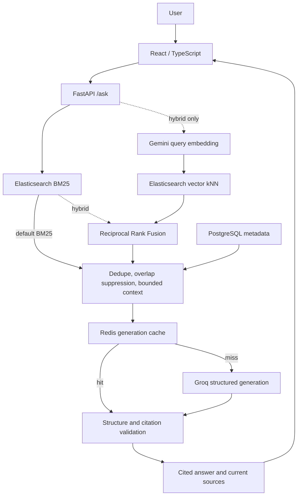

# Podcast RAG

Search podcast transcripts and ask questions with answers linked to the passages that support them. Podcast RAG combines a React/TypeScript interface, FastAPI, Elasticsearch BM25 and optional Gemini vector retrieval, with Groq generating cited answers from selected evidence. A small real-data evaluation compares retrieval quality and latency across the same corpus and judgments, rather than relying on demo answers alone.

## Highlights

- **Search and Ask:** keyword search stays independent from optional question answering.
- **Traceable evidence:** paragraph citations link to episode metadata, timestamp ranges and full source passages.
- **Optional hybrid retrieval:** BM25 + 768-dimensional Gemini vectors, fused with Reciprocal Rank Fusion (RRF); BM25 remains the default and fallback.
- **Failure-aware generation:** strict structured output, application citation checks, abstention and generation-only Redis caching.
- **Bounded data preparation:** stream a small Spotify archive sample, preserve compliance identifiers, and rerun ingestion/backfill safely.
- **Measured trade-off:** on 20 real-data queries, Hit@5 increased from **0.75 to 0.90**, while mean retrieval latency increased from **37.6 ms to 744.0 ms**.

## Architecture

The diagram shows the Ask path. The separate `/search` path returns lexical search results without embedding or LLM calls.



Source transcripts and vectors live in separate Elasticsearch indexes. Vector hits must resolve back to matching canonical source text before they become evidence. [Architecture details](documentation/architecture.md).

## How Retrieval Works

1. **Lexical retrieval:** BM25 matches questions against transcript text, with fuzzy matching for spelling variations. RAG reads full passages, not search highlights.
2. **Optional semantic retrieval:** Hybrid embeds the question with `gemini-embedding-2` at 768 dimensions, then searches a compatible vector index.
3. **Rank fusion:** RRF combines the ranked lists by stable chunk identity. A passage found by both receives contributions from both; deterministic tie-breaking applies to fixed rankings.
4. **Context selection:** exact duplicates and heavily overlapping clips are suppressed, then source-count and evidence-size limits are applied.
5. **Fallback:** unavailable embeddings or vector infrastructure leave BM25 evidence available. The response reports the actual retrieval mode.

Defaults are 30 lexical and 30 vector candidates, RRF `k=60`, and at most six selected sources totaling 16,000 UTF-8 bytes of transcript. The server controls retrieval mode; the UI does not select providers or models.

## Grounded QA

Groq receives bounded evidence with source labels, metadata and timestamps. Instructions require evidence-only answers, citations for every substantive paragraph, and abstention when evidence is insufficient; transcript instructions are treated as untrusted data.

The adapter requests strict JSON Schema output. Python then rejects malformed answers, blank paragraphs, inconsistent status, missing citations and IDs outside the context actually supplied. This validates citation membership, **not semantic entailment**.

The UI renders paragraphs and citation links to source cards. If generation fails, retrieved sources remain visible. Redis caches validated generation for 15 minutes by default, but **retrieval runs on every request**, and cached output is revalidated against current evidence. Redis failures do not prevent fresh RAG generation.

## Real-Data Evaluation

The completed local evaluation used **20 real podcast episodes**, **730 transcript chunks** from 120-second windows with 60-second overlap, and **730 Gemini embedding-2 document vectors**. Both modes used the same fixed corpus and **20 AI-assisted, human-reviewed and approved queries/judgments**.

| Metric | BM25 | Hybrid |
|---|---:|---:|
| Hit@1 | 0.6000 | 0.7000 |
| Recall@1 | 0.2917 | 0.3417 |
| Hit@3 | 0.6500 | 0.8500 |
| Recall@3 | 0.3167 | 0.4333 |
| Hit@5 | 0.7500 | 0.9000 |
| Recall@5 | 0.3667 | 0.4500 |
| MRR | 0.6417 | 0.7875 |
| Binary nDCG@5 | 0.4024 | 0.5019 |
| Mean retrieval latency (ms) | 37.6000 | 744.0200 |
| Median retrieval latency (ms) | 36.8184 | 740.8537 |
| Retrieval errors | 0 | 0 |

Hybrid succeeded for 20/20 queries, with zero BM25 fallbacks, vector failures or no-usable-vector cases.

**On this small real-data evaluation set, Hybrid retrieval improved retrieval-quality metrics at the cost of substantially higher latency.** Hit@3 improved by 0.20 and Hit@5 by 0.15; MRR increased from 0.6417 to 0.7875 and nDCG@5 from 0.4024 to 0.5019. Hybrid adds query embedding, vector lookup and source hydration work. These are retrieval timings, not end-to-end answer generation latency.

This is a small-scale evaluation, not a large benchmark or evidence of universal superiority. BM25 remains the default. [Methodology, fingerprint and limitations](documentation/evaluation.md).

## Tech Stack

| Layer | Implementation |
|---|---|
| Frontend | React 19, TypeScript, Vite 8, Tailwind CSS |
| Backend | Python 3.12, FastAPI, Pydantic, HTTPX |
| Retrieval | Elasticsearch 8.13.0 BM25 and dense-vector kNN; application-side RRF |
| Embeddings / generation | Gemini `gemini-embedding-2` (768 dimensions) / Groq |
| Infrastructure | PostgreSQL 16, Redis 7, Docker Compose |
| Validation | pytest, mocked providers, opt-in Docker integrations, Vitest / Testing Library |

## Quick Start

Use Python 3.12, Node.js 24 and Docker Compose. Commands below use PowerShell from the repository root; on other shells use equivalent virtual-environment paths.

```powershell
python -m venv .venv
.\.venv\Scripts\python.exe -m pip install -r ingest/requirements.txt -r api/requirements.txt
if (-not (Test-Path .env)) { Copy-Item .env.example .env }
docker compose up -d
```

Wait for Elasticsearch, PostgreSQL and Redis to be ready. On a **fresh local installation**, create a small synthetic corpus; the real dataset is not required:

```powershell
.\.venv\Scripts\python.exe -c "from scripts.sample_data import generate_fixtures; generate_fixtures('.local-eval/synthetic', count=5)"
.\.venv\Scripts\python.exe -m ingest.ingest --transcripts-dir .local-eval/synthetic/transcripts --metadata-tsv .local-eval/synthetic/metadata.tsv --workers 2
```

Run that legacy seed once: generated Elasticsearch IDs can duplicate documents on repeated imports. Skip it when preserving an existing corpus. It uses process environment variables, not automatic `.env` loading.

Start an evidence-enabled API, then the frontend in another terminal:

```powershell
$env:RAG_ENABLED = 'true'
$env:RAG_RETRIEVAL_MODE = 'bm25'
.\.venv\Scripts\python.exe -m uvicorn api.main:app --env-file .env --host 127.0.0.1 --port 8000
```

```powershell
cd ui
npm ci
npm run dev
```

Open the Vite URL (normally `http://localhost:5173`). Without LLM configuration, Ask returns evidence with `answer: null`. Set generation credentials privately in the server environment or ignored `.env`:

| Settings | Purpose |
|---|---|
| `ES_HOST`, `POSTGRES_DSN`, `REDIS_URL` | Service connections; defaults target local Compose services. Keep PostgreSQL settings consistent with Compose. |
| `RAG_ENABLED=true`, `RAG_RETRIEVAL_MODE=bm25` | Enable Ask while retaining default lexical retrieval. |
| `RAG_LLM_PROVIDER=groq`, `RAG_LLM_MODEL` | Select Groq and a model supporting strict Structured Outputs. |
| `RAG_LLM_API_KEY` | Server-only generation credential; never use a `VITE_*` secret. |
| `RAG_SOURCE_INDEX` | Ask/evaluation source index; defaults to `podcast_clips`. |

Previously validated starting settings are `openai/gpt-oss-20b`, an 8000-token estimated context budget, 1600 output tokens and a 20-second timeout. These are configuration choices, not universal optima. See [.env.example](.env.example) and [operational configuration](documentation/development-notes.md#configuration-and-local-startup) for code defaults and optional Gemini setup.

## API

| Endpoint | Behavior |
|---|---|
| `GET /search?q=...&from=0&size=10` | Searches `podcast_clips`; returns `query`, `total`, `clips` and `took_ms`, with highlighted excerpts and metadata. `size` is capped at 100. |
| `POST /ask` | Accepts `{"question":"..."}`; trims and validates 1–2000 characters. Returns status, optional answer paragraphs, sources, actual retrieval mode, `degraded`, `cached`, reason and timing. |
| `GET /sources/{chunk_id}` | Resolves exact evidence and current metadata from `RAG_SOURCE_INDEX`; unknown/stale sources return 404, unavailable retrieval returns 503. |
| `GET /health` | Returns `{"status":"ok"}`; a liveness response, not a dependency-readiness check. |

Ask statuses are `answered`, `insufficient_context`, `generation_unavailable`, `invalid_generation` and `disabled`. Retrieval infrastructure errors return HTTP 503; invalid input returns 422. Successful answers contain `answer.paragraphs`, each with `text` and `source_ids`. RAG settings do not change `/search`; its legacy `clip_minutes` parameter is accepted but does not currently alter retrieval windows.

## Evaluation CLI

With a locally reviewed dataset and matching source/vector configuration:

```powershell
.\.venv\Scripts\python.exe -m api.rag.evaluate --dataset .local-eval/queries.jsonl --mode both --output .local-eval/comparison.json
```

Use `--mode bm25` for a provider-free lexical run. Hybrid evaluation uses Gemini, never Groq. Reports and judgments remain local; the repository includes only a tiny synthetic test fixture. [Evaluation format and reproduction guidance](documentation/evaluation.md#reproduction).

## Testing

```powershell
.\.venv\Scripts\python.exe -m pytest
# Opt in to isolated Docker-backed tests:
$env:RAG_INTEGRATION_TESTS = '1'
.\.venv\Scripts\python.exe -m pytest
Remove-Item Env:RAG_INTEGRATION_TESTS
```

From `ui/`, run `npm test` and `npm run build`. Provider tests use fakes or mocked HTTP, not real Gemini/Groq requests. Integration tests use temporary indexes and isolated database data. [Coverage and operational checks](documentation/development-notes.md#validation).

## Demo

Screenshots of the Search and Ask interfaces can be added here. No screenshots are currently included.

## Limitations

- Twenty reviewed queries and one small corpus do not establish broad retrieval quality or statistical significance.
- Hybrid adds network latency, provider cost and rate-limit exposure; Groq availability also affects generation.
- Valid citations do not prove factual entailment. ASR errors and chunk boundaries can affect evidence quality.
- Context budgeting uses a conservative byte-based approximation, not an exact model tokenizer.
- This is a local application, without production authentication, streaming answers or conversation history.

## Dataset and Privacy

Spotify Podcasts 2020 dataset files are **not distributed in this repository**. Keep real transcripts, metadata, embeddings, judgments and evaluation artifacts local and out of Git; publish only permitted aggregate results. The sample importer retains show/episode filename prefixes for later compliance and retraction handling, but does not automate that process. Follow the dataset's access and usage requirements.

Keep API keys server-side in the local environment or ignored `.env`, never in source control, browser configuration or documentation. Selected transcript context is sent to Groq for live generation; document text is sent to Gemini during backfill and questions during Hybrid retrieval. Local retention does not mean provider-free processing.

[Architecture](documentation/architecture.md) · [Evaluation](documentation/evaluation.md) · [Development and operations](documentation/development-notes.md)
